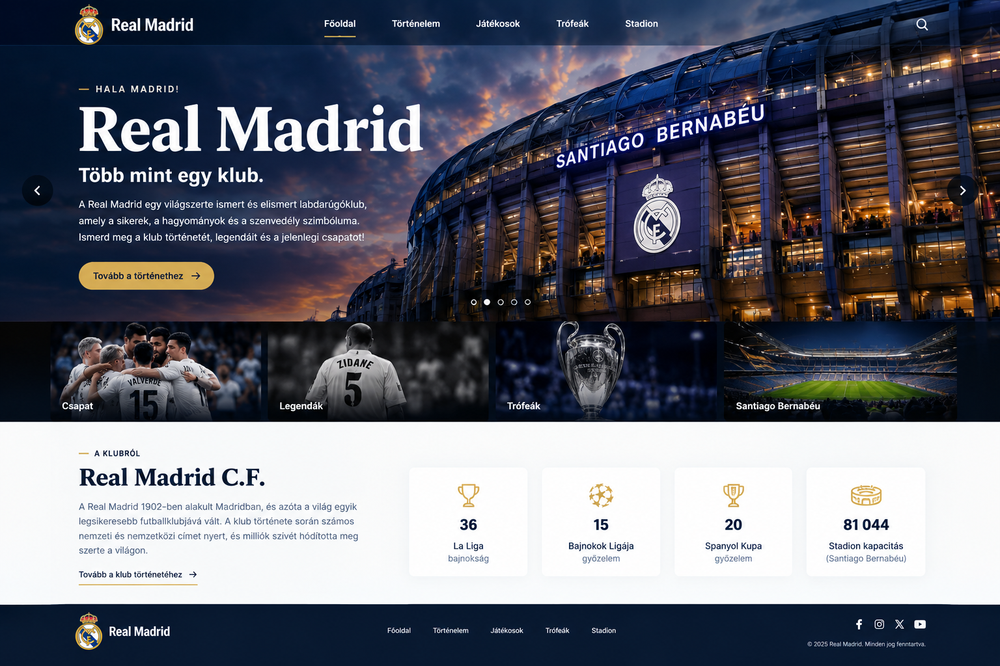

**# Projektmunka - Real Madrid**

A projekt egy Real Madrid témájú weboldal elkészítéséről fog szólni.

A projektet az **UEFA Magyarország** keretében kaptuk feladatként, ahol azt a megbízást kaptuk, hogy készítsünk egy modern, látványos és könnyen átlátható weboldalt a Real Madridról.

A weboldal célja, hogy egy helyen mutassa be a klub történetét, fontosabb trófeáit, jelenlegi játékosait, legendáit és a Santiago Bernabéu stadiont.

A weboldal megtervezése előtt elkészítettünk **3 különböző látványtervet**, amelyek segítségével bemutattuk, hogyan nézhetne ki a kész weboldal.

**## Látványtervek**

Az elképzelések bemutatásához 3 különböző látványképet készítettünk a weboldal főoldaláról.

**### 1. Látványterv**

> 

**### 2. Látványterv**

> **[IDE KERÜL A 2. LÁTVÁNYKÉP]**

**### 3. Látványterv**

> **[IDE KERÜL A 3. LÁTVÁNYKÉP]**

**## Forrás**

- https://www.realmadrid.com/

- https://www.uefa.com/nationalassociations/teams/50051--real-madrid/

- https://en.wikipedia.org/wiki/Real_Madrid_CF

**## 1. Honlap**

- Felül egy egyszerű navbar található.

- A navbarból elérhetőek a weboldal különböző oldalai.

- A főoldalon egy nagy Real Madrid témájú kép található.

- Rövid bemutatás szerepel a klubról.

- Néhány fontos adat külön részekben jelenik meg.

- Az oldalon képes elemek és különböző kártyák is találhatóak.

- Az oldal végén egy footer található.

**## 2. Történelem**

- Az oldal a Real Madrid történetét mutatja be.

- A fontosabb események időrendi sorrendben jelennek meg.

- Rövid leírás tartozik az egyes korszakokhoz.

- A fontosabb évszámok külön kiemelést kapnak.

- A történelmi eseményekhez képek is tartoznak.

**## 3. Játékosok**

- Az oldal a Real Madrid jelenlegi játékosait mutatja be.

- A játékosok külön kártyákon jelennek meg.

- A kártyákon a játékos neve, mezszáma és posztja szerepel.

- A játékosok posztok szerint vannak csoportosítva.

- A játékosokhoz képek is tartoznak.

**## 4. Trófeák**

- Az oldalon a Real Madrid fontosabb trófeái jelennek meg.

- Külön szerepelnek a nemzetközi és spanyol sorozatok.

- Minden trófeához tartozik egy rövid leírás és a megnyert címek száma.

- A trófeák képekkel és külön kártyákon jelennek meg.

**## 5. Santiago Bernabéu**

- Az oldal a Santiago Bernabéu stadiont mutatja be.

- Röviden bemutatja a stadion történetét.

- A stadion fontosabb adatai is megjelennek.

- A stadion felújítása is szerepel az oldalon.

- Több kép segítségével lesz bemutatva a stadion.

**## 6. Legendák**

- Az oldal a Real Madrid korábbi legendás játékosait mutatja be.

- A játékosok külön kártyákon jelennek meg.

- Rövid bemutatás tartozik minden játékoshoz.

- A klubnál elért fontosabb eredményeik is szerepelnek.

- A legendás játékosokhoz kapcsolódó képek is megjelennek.
